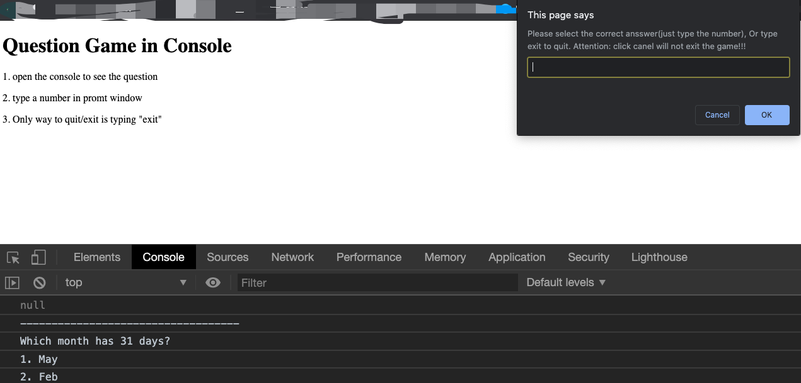

# Javascript-Games-Demo
several projects to onboarding to practice javascript
1. A simple question game playing with console and promt window
*  open the console to see the question
* type a number in promt window
* Only way to quit/exit is typing "exit"
  
